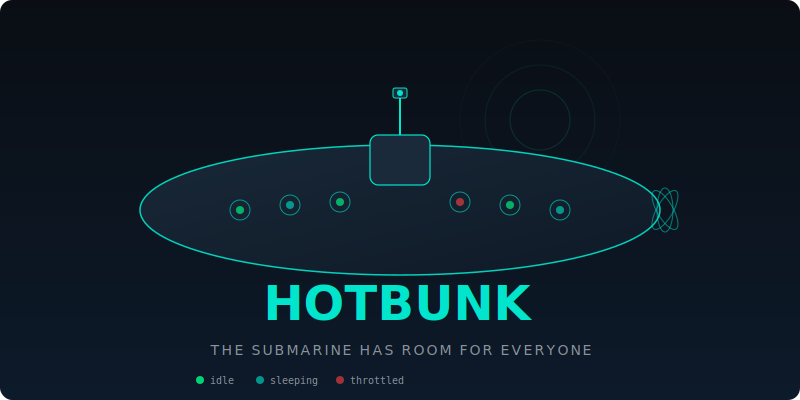

<p align="center">
  
</p>

**Your Claude Max account sits idle while you sleep. That's $3,000/month in unused capacity.**

HotBunk is a cooperative compute orchestrator for Claude Code that load-balances automated workloads across multiple Max accounts, using idle capacity that would otherwise be wasted.

*The submarine has room for everyone.*


## The Math

A Claude Max subscription costs $100-200/month. The equivalent API tokens for the same volume of Opus/Sonnet usage would cost $3,000-30,000/month. That's a 30-50x arbitrage.

But each account has rate limits. You hit the ceiling, you wait. Meanwhile, your teammate's account is doing nothing. Your second account is doing nothing. Eight hours of sleep is eight hours of premium compute sitting dark.

HotBunk fixes this. Pool your accounts. Run automated workloads on whoever has headroom. Interactive sessions always take priority. Nobody waits.

## How It Works

On submarines, crews share the same bunks across shifts. There aren't enough beds for everyone at once, so when one sailor is on watch, another sleeps in their bunk. The bunk is always "hot" - always in use.

HotBunk does this with Claude Code rate limits. Your account runs someone else's automated jobs while you sleep. Their account runs yours while they're in a meeting. The capacity is always hot.

```
You (interactive) -----[your account]                    [their account]---- their agents running
You (sleeping)    -----                [your account]----  agents running    [their account]---- them (interactive)
```

Every account owner explicitly opts in. Every owner controls exactly what runs on their account and when. Nothing happens without consent.

## Quick Start

```bash
pip install hotbunk

# Log in to your first Claude account and register it
claude auth login --email work@example.com
hotbunk register work --email work@example.com

# Log in to your second account and register it
claude auth login --email personal@example.com
hotbunk register personal --email personal@example.com

# See your pool
hotbunk status
```

## CLI

### `hotbunk status` - See the pool at a glance

```
                    HotBunk Pool Status
+----------+---------------------+-------------+------+----------+----------+-----------------+
| Account  | Email               | State       | Tier | Sessions | Auto Jobs| Headroom        |
+----------+---------------------+-------------+------+----------+----------+-----------------+
| work     | drew@company.com    | INTERACTIVE | t3   |    1     |    0     | [||||      ] 40% |
| personal | drew@personal.com   | SLEEPING    | t3   |    0     |    2     | [||||||||  ] 80% |
+----------+---------------------+-------------+------+----------+----------+-----------------+
```

### `hotbunk submit` - Run a job on the best available account

```bash
# Submit an automated agent job
hotbunk submit militia -c "claude -p 'run the nightly audit'"

# Submit a CI job
hotbunk submit ci -c "claude -p 'review PR #42 and post comments'"

# Dry run to see which account would be picked
hotbunk submit training -c "claude -p 'generate training pairs'" --dry-run
```

HotBunk picks the account with the most headroom, respecting every owner's policy.

### `hotbunk switch` - Change your interactive account

```bash
hotbunk switch personal   # Switch your active Claude session to 'personal'
hotbunk which             # Show which account you're on right now
```

### `hotbunk policy` - Control what runs on your account

```bash
hotbunk policy              # View your current policy
hotbunk policy --edit       # Open policy in your editor
```

Every account has a policy file (YAML) that controls everything:

```yaml
owner: drew
email: drew@company.com
interactive_priority: always    # your sessions always win
allow_automated: true           # pool can use your idle capacity
automated_types:                # what job types you allow
  - militia
  - training
  - ci
sleep_window: "22:00-06:00"    # hours you definitely won't be using it
availability: always            # always | workdays | weekdays | custom
max_automated_concurrent: 2     # cap on simultaneous automated jobs
```

## Account States

| State | Meaning | Automation? |
|-------|---------|-------------|
| **INTERACTIVE** | Owner is in an active session | No - hands off |
| **IDLE** | No active session detected | Yes - within policy limits |
| **SLEEPING** | Inside declared sleep window | Yes - full access |
| **THROTTLED** | Hit a rate limit, recovering | No - backing off |
| **COOLDOWN** | Recently throttled, deprioritized | Yes - but last resort |

Interactive sessions always have absolute priority. Automated workloads are scavengers - they only touch idle capacity. When an owner starts a session, automated work yields immediately.

## Architecture

```
                         +-----------------------+
                         |   always-on machine   |
                         |   - orchestrator      |
                         |   - SQLite state      |
                         |   - dashboard :3000   |
                         +-----------+-----------+
                                     |
                              mesh network
                    +----------------+----------------+
                    |                |                 |
              +-----+-----+  +------+------+  +------+------+
              | machine-1  |  | machine-2   |  | machine-3   |
              | agent      |  | agent       |  | agent       |
              +-----+------+  +-------------+  +-------------+
                    |
              interactive
              sessions here
```

**Orchestrator** - Python daemon on your always-on machine. Tracks account states, assigns jobs to the best available account, exposes a REST API and dashboard.

**Machine Agent** - Lightweight process on each machine. Reports active sessions, detects which account is in use, receives job assignments, manages `CLAUDE_CONFIG_DIR` switching.

**CLI** - The `hotbunk` command. Submit jobs, check status, switch accounts, edit policies.

**Dashboard** - Web UI showing pool status, active jobs, usage history. FastAPI + HTMX, no JS framework.

## The Consent Model

Trust is the foundation. HotBunk is designed so that every account owner stays in full control:

- **Opt-in only** - Nothing runs on your account until you explicitly allow it
- **Policy-controlled** - You choose which job types are allowed, what hours, how many concurrent
- **Instant revoke** - `hotbunk policy --edit` and set `allow_automated: false`. Done.
- **Full audit trail** - Every job assignment is logged. You can see exactly what ran on your account and when
- **Interactive priority is absolute** - If you start a session, automated work yields. Always. No exceptions.

No credentials are shared between users. Each account's OAuth tokens stay in their own isolated directory with 600 permissions.

## Roadmap

**Now (v0.1)** - CLI, account registration, pool status, job submission, policy engine, session detection

**Next (v0.2)** - Orchestrator daemon, multi-machine coordination, REST API, basic dashboard

**Later (v0.3+)** - Rate limit prediction ("account X recovers in ~20 min"), usage analytics, Slack notifications ("your account just picked up a batch"), queue priorities, web-based policy editor

## Tech Stack

| Component | Technology |
|-----------|-----------|
| CLI | Python, Click, Rich |
| Orchestrator | FastAPI, SQLite |
| Dashboard | FastAPI + HTMX |
| Process detection | Platform-native (pgrep/tasklist) |
| Networking | Tailscale (or any mesh) |
| Packaging | pip installable |

## Requirements

- Python 3.12+
- Claude Code CLI installed and authenticated
- Linux, macOS, or Windows

## Why This Exists

If you're running Claude Code agents, CI pipelines, training data generation, or any automated workload, you're burning through rate limits on one account while other accounts sit idle. HotBunk turns N separate rate-limited accounts into one shared pool where capacity is always being used by someone.

The more accounts in the pool, the more total throughput everyone gets. It's cooperative, not competitive.

## License

MIT
